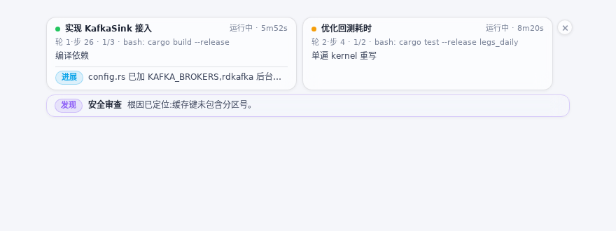

# dsh-subagent-progress

English | [中文](README.zh.md)

> **One-liner:** Live progress for your subagents, right above the input box — what they're doing, how far along they are, whether they're stuck. No clicking into transcripts.



[](https://www.npmjs.com/package/dsh-subagent-progress) [](https://github.com/edgeseeker7/dsh-subagent-progress/actions)

## What you see

- **One card per running subagent**: label, turn/step, todo completion (`1/3`), the exact action in flight (`bash: cargo build --release`, not a bare tool name), and elapsed time.
- **Subagents report in their own words**: one-sentence updates about progress, how long remains, and key discoveries — brand blue = progress, amber = ETA, green = finding (all sourced from DS theme variables, light/dark adaptive).
- **Stall alerts**: a live subagent silent for 5+ minutes turns its status dot amber.
- **Aligned at any count**: cards snap into an equal-width grid with a uniform four-row structure, so they line up perfectly whether there are two or ten; beyond two rows the panel scrolls instead of eating your screen.
- **Zero nagging**: when a subagent finishes, its card lingers 30 seconds then disappears; important findings linger 3 minutes before disappearing too; every card has its own × to dismiss it individually, and the corner × dismisses the whole dock — either way, everything reappears on its own when new activity arrives.

## Install

```bash
dsh plugin --profile web add dsh-subagent-progress
```

Then restart `dsh web`. Published on npm as [dsh-subagent-progress](https://www.npmjs.com/package/dsh-subagent-progress). Requires dsh ≥ 0.1.2-rc.1 (verified on both 0.1.2-rc.1 and 0.1.5-rc.1).

## Usage

- **Click a card** → open that subagent's full session.
- **Hover the update area** → a frosted popover shows the full update, markdown-rendered (lists and code blocks intact).
- No configuration needed — install and it works.

## How it works (30-second version)

Two channels, one outlet:

- **Passive observation**: every subagent's session events (turns, steps, tool calls, assistant text) are folded into a small progress state that dsh's projection framework **pushes to every browser automatically** — so there is always progress on the card, even if the model never says a word.
- **Active reporting**: every subagent gets a `notify_user` tool plus guidance to report in single sentences (and a gentle reminder after 6 consecutive tool calls without one). Each report is an ordinary event in the child's durable session log, carried out by the same channel — persistent and replayable by construction.

No dsh source is modified; the host half works in any deployment, the UI half renders only under dsh web.

## More

- [CHANGELOG](CHANGELOG.md) — what changed in each version
- Feedback: [GitHub Issues](https://github.com/edgeseeker7/dsh-subagent-progress/issues)
- License: MIT
